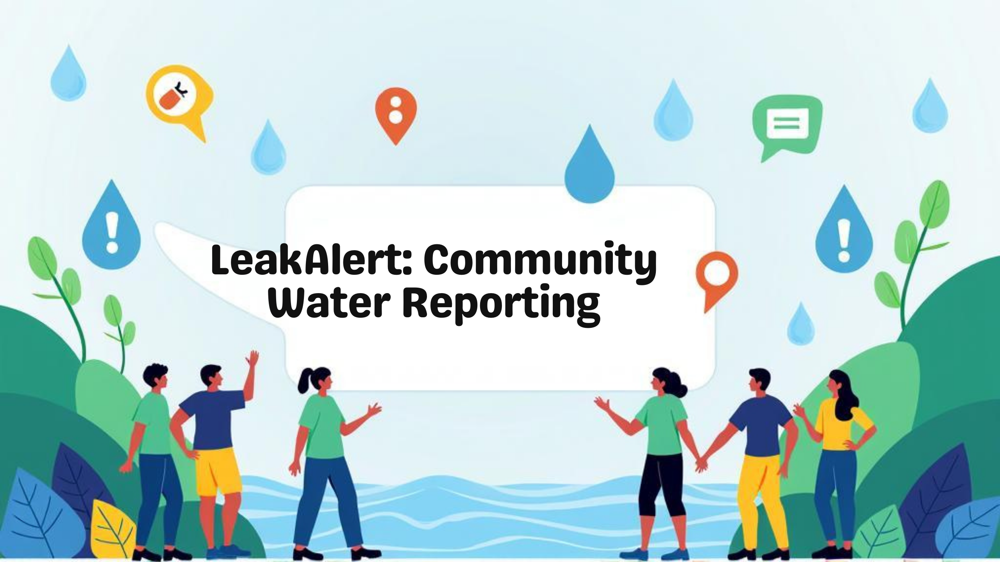

# 🚰 LeakAlert – Community Water Leak Reporting App  

  

---

## 📌 Problem Statement  
Every year, *millions of liters of water are wasted* due to unnoticed leaks.  
Most leaks are reported too late because there is *no simple, community-driven tool* to track them in real-time.  

---

## 💡 Our Solution  
*LeakAlert* is a lightweight web app that empowers communities to:  
- 📍 *Report leaks instantly* with location, description & photo.  
- 🗺 *Visualize leaks on an interactive map* using OpenStreetMap.  
- 📝 *Track and manage reports* to help residents and authorities fix issues quickly.  

---

## ⚙ Features  
✅ Report leaks with *location, description, and image*.  
✅ View reports on an *interactive map*.  
✅ *Report list* for easy viewing.  
✅ *LocalStorage support* → works offline for demo.  
✅ *Clear All Reports & Reset* functionality.  
✅ *Success message* after submitting a report.  

---

## 🛠 Tech Stack  
- *Frontend*: HTML, CSS, Vanilla JavaScript  
- *Map Integration*: [Leaflet.js](https://leafletjs.com/) + OpenStreetMap  
- *Storage*: LocalStorage (demo purpose)  

🚀 Future-ready: Can be extended with *Node.js + MongoDB / Firebase* for real-time multi-user sync.  

---

## 🎯 Impact  
- 💧 Saves *water* by detecting leaks early.  
- 🏘 Encourages *citizen participation* in water conservation.  
- 🛠 Helps *authorities prioritize repairs* efficiently.  
- 🌍 Scalable to *cities, societies, and villages*.  

---

## 🚀 Future Scope  
- 🔄 Real-time backend (Node.js + MongoDB / Firebase).  
- 🤖 AI-powered leak detection from uploaded images.  
- 🔔 Push notifications for nearby residents/authorities.  
- 🌐 Multilingual support (English, Hindi, Marathi,and more.).  

---
## 📸 Screenshots  
[form](assets/screenshot1.jpg) 
[map](assets/screenshot2.jpg) 
[donut grap](assets/screenshot3.jpg) 
[list of leak](/assets/screenshot4.jpg) |

---

## 👥 Team / Contributors  
- [Rutuja Jadhav]| (https://github.com/rutuja1102/LeakAlert) 

---

## ✨ Closing Note  
"LeakAlert is not just a hackathon project — it’s a step toward solving one of the world’s biggest crises: **water scarcity*.  
Being from **Latur**,where water is as valuable as gold,I know the importance of saving every drop.
If communities can report leaks in seconds, we can save millions of liters every day.  
Small leaks today won’t become big problems tomorrow."*  

---

[def]: http://github.com/rutuja1102/LeakAlert# LeakAlert
